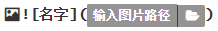

# README-File-Use
README文件使用技巧经验

---

1. # 文件中添加图片

   1. ##### 使用格式

      ##### 其中 ！ [] ()  均为英文字符；! 为图片显示的头；[]内可以写任意字符，其中的内容是图片不能正常显示时替代显示的文字；() 为图片路径;

      ##### 可以是项目内的路径**，*<u>注意使用相对项目的地址目录层级要用 "/" ,使用 "\\"虽然在readme 本地文件能显示，但在git上均不能显示。</u>***

      ##### 也可以是网络路径，网络地址直接复制就行，*<u>**其目录层级用的是 "\\";**</u>*

      ##### readme文件中在图片或连接上右键可以缩放图片调整大小，

      1. ###### 项目中的相对地址，例如该项目中，要显示 图片/10f00cfba90c332d16dfdebd7d203978.jpg  ，想要显示只需要输入 ：

      ##### 

      

   2. ###### 使用网络地址，这里要注意，使用图片的地址时，必须要复制图像连接才行

      1. 例如，github上的图片
      2. 网络上的图片

2. 使用格式<!---->

3. 

   
